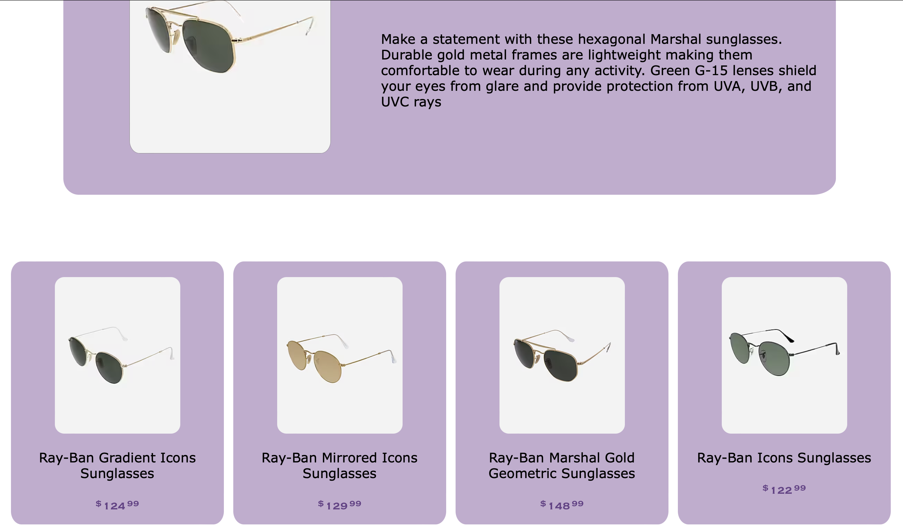
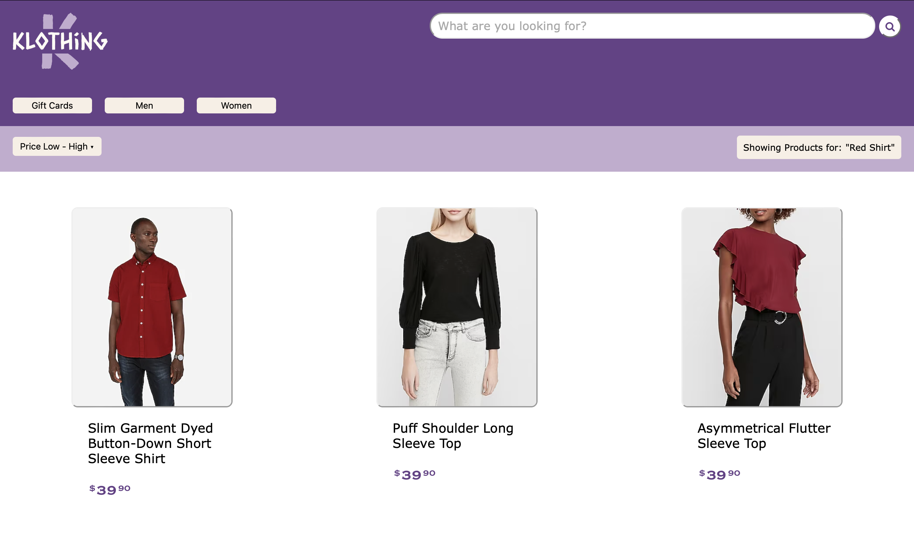
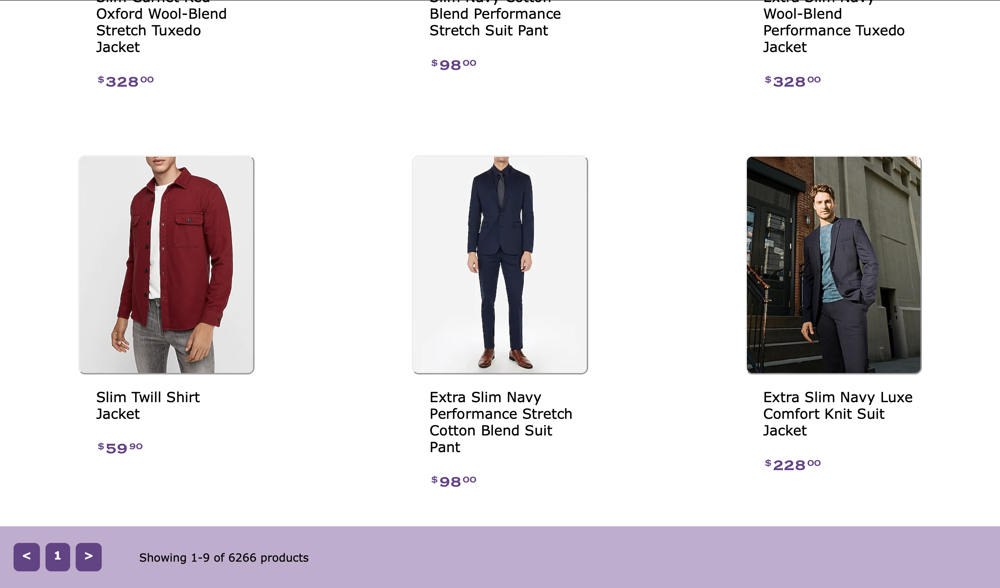
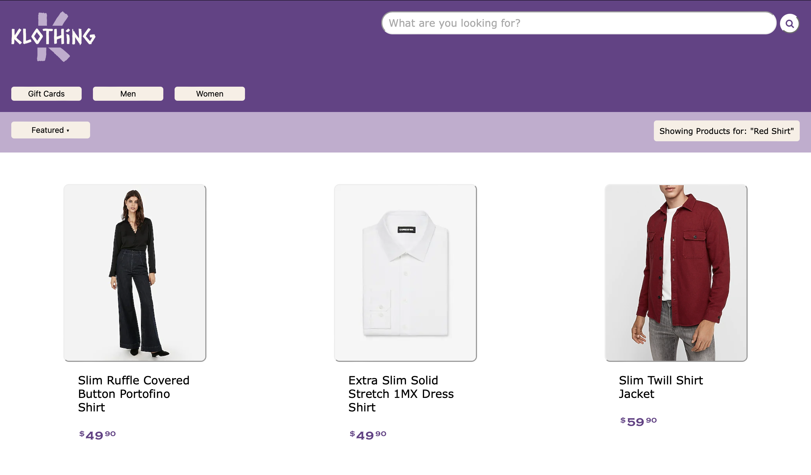
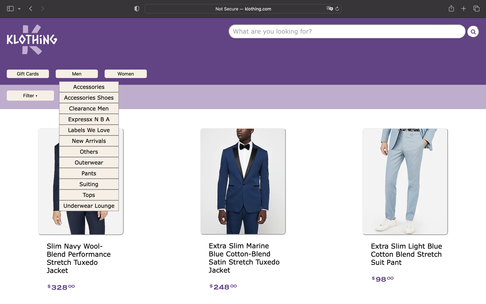
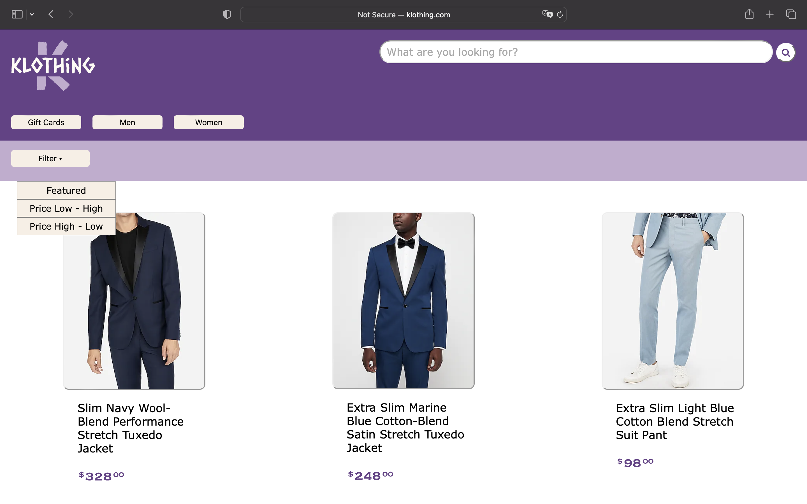

# Klothing.com
The prpoject consists of two components: Frontend and Backend.
Backend is coded using Pythion and Flask.
Frontend is using HTML and javascript.
All the API are restful and are made using flask_resftul module.

 
 
# PPT Link
https://www.canva.com/design/DAFaeD5Wo-8/MzYFwVJ9_aiEYEOXln6vjw/view?utm_content=DAFaeD5Wo-8&utm_campaign=designshare&utm_medium=link2&utm_source=sharebutton

 
 
# API Spec

- Data Ingestion:
     POST 
    "/upload"  HTTP/1.1
    Host: localhost
    Content-Type: application/json
- input should be out.json file
 
 
- Fetch Product: 
    GET /product/<string:productId> HTTP/1.1 
    Host: localhost 
 
 
- Category Tree 
    GET /categoryTree HTTP/1.1 
    Host: localhost 
 
 
- Product Query 
     GET 
    "/product_query/<string:searchQuery>"  HTTP/1.1
    Host: klothing.com 
 
 
- Category  
    GET 
    "/category/<string:catId>"  HTTP/1.1
    Host: klothing.com 
 
 
 

# add this file to unbxd training/Assignment-Team01 folder
.env 
CACHE_TYPE=redis 
CACHE_REDIS_HOST=redis 
CACHE_REDIS_PORT=6379 
CACHE_REDIS_DB=0 
CACHE_REDIS_URL=redis://redis:6379/0 
CACHE_DEFAULT_TIMEOUT=500 
 

# Docker Installation Instruction
To run backend:
- Go to Assignment folder
- Run:  minikube start

        minikube tunnel

        In build folder run:
        kubectl apply -f adminer-deployment.yaml,adminer-service.yaml,api-deployment.yaml,api-service.yaml,assignment-team01-default-networkpolicy.yaml,database-deployment.yaml,database-service.yaml,env-configmap.yaml,redis-deployment.yaml,redis-service.yaml,frontend-deployment.yaml,frontend-tcp-service.yaml

         kubectl port-forward deployment/api 7002:7002

- On terminal run this command for data ingestion into database :
        curl http://127.0.0.1:7002/upload -d @out.json -H "Content-Type: application/json

In browser:
- Open localhost to access GUI
 
 

Screenshots:
 
## Homepage 

 
## Product display page

 
## Recommendations  

 
## Filter

 
## Pagination

 
## Search Page

 
## Category Dropdown 

 
## Filter Dropdown 

 

